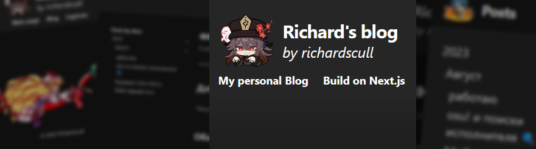

<h1 align="center">Richard's blog page</h1>
<h1>
    
</h1>
<h4 align="center">🔥 A blog application built on Next.js, who offers support for markdown-based posts. </h4>

# 🔧 Requirements
If you want to try app by yourself, you will need:
- Node.js v10.13 or higher

# ⚙️ Setup
To start, clone the `template` branch from this repository and install all required dependencies:
```shell
git clone -b template https://github.com/richardscull/Richards-Blog
cd Richards-Blog
npm install
```
###### ⚠️ The `main` branch contains posts from my blog. For the best experience, I highly recommend cloning the `template` branch.

After that, you can sucesfully run the site on your local network by typing:
```shell
npm run build
npm run start
```
or
```shell
npm run dev
```

